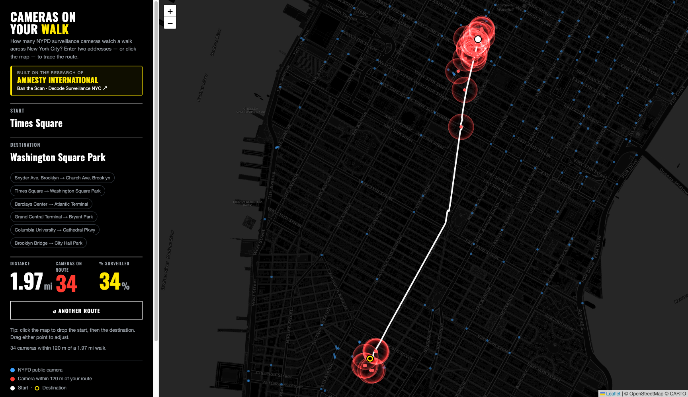

# Cameras On Your Walk — NYC

A classroom-ready rebuild of Amnesty International's **Ban The Scan** *"take a walk in
NYC"* tool. Type **any two NYC addresses** (with autocomplete), or **click the map**, and
it traces the walking route and counts the NYPD surveillance cameras along the way — the
feature the live site now only offers for three pre-chosen walks.

**Credit:** this is built entirely on the research and open data of
**[Amnesty International — Ban the Scan / Decode Surveillance NYC](https://banthescan.amnesty.org/decode/)**.
The tool links to it prominently.

**Deliverable:** [`banthescan-walk.html`](./banthescan-walk.html) — one self-contained
file (camera data, gazetteer, and example routes all embedded).



---

## What it does

- **Autocomplete** address entry (start + destination), and **click-the-map** to drop
  points; **drag** either point to adjust — the route recomputes.
- Shows **all 2,531 public NYPD cameras** as blue dots; those within **120 m** of your
  route glow red (an additive radial glow matching the original), and are counted.
- Reports **distance**, **cameras on route**, and **% of the walk surveilled**.

### Faithful to the original's method

- **Radius is fixed at 120 m** — that is the facial-recognition reach of the NYPD's
  public PTZ (Argus) cameras (`C1 = 120` in the original). It does not vary; only a
  graded *exposure intensity* varies within it (that's the glow gradient).
- **Only public cameras are counted.** Verified in the original bundle: the walk app
  loads only `/data/cameras.json` (2,531 public cameras) for its route count; the 14,186
  "all cameras" file (incl. ~11,655 private) is used *only* on the separate "Explore the
  Data" overview map, **never** in the path count. Private cameras don't carry the 120 m
  FR range, so they're excluded here too.

---

## Built to survive a whole class on one IP

The public geocoding/routing services rate-limit **per IP**, so 40 students behind one
university IP could get throttled. The design keeps the core experience **offline**, so
almost no external requests are made:

| Concern | Mitigation |
|---|---|
| **Autocomplete** (per-keystroke — the biggest risk) | Served from a **bundled 3,600-place NYC gazetteer** (neighbourhoods, subway stations, parks, landmarks, universities). Fully offline; the network is touched only if local hits are sparse. |
| **The class exercise** (everyone tries the same walk at once) | **6 example walks are precomputed and bundled** — they route with **zero** network calls. |
| **Map-click labels** (reverse geocoding) | Resolved from the local gazetteer (nearest place) — **offline**. |
| **Ad-hoc routing** (free exploration) | Results are **cached** in `localStorage`; before any live call a **random 0–2.5 s de-sync delay** smears synchronized bursts; transient 429/503 get **jittered exponential-backoff retries**. Average class load is well under the limits; it degrades to *slightly slower*, never *blocked*. |
| **Map tiles** | CartoDB dark tiles are CDN-backed and browser-cached (high limits). |

**Bulletproof option (any scale):** if you expect heavy simultaneous free-form use, run
the routing/geocoding locally so there is **no shared external dependency at all**:

```bash
# One machine on the classroom network (e.g. the teacher's laptop):
docker run -p 5000:5000 osrm/osrm-backend   # + a local Nominatim/Photon, or a caching proxy
```

Then point `walkRoute`/`suggest` in `src/services.mjs` at `http://<that-host>:…` and
rebuild. All 40 browsers hit the local instance; the public internet sees nothing.

---

## Use it

**Simplest:** open `banthescan-walk.html` in a browser (double-click usually works;
needs internet for map tiles, and for routing addresses that aren't a bundled example).

**Most reliable for a projector:** serve it, then open the URL:

```bash
npm run serve        # -> http://127.0.0.1:8777/banthescan-walk.html
```

## Develop

```
src/geo.mjs        Pure geometry + counting (haversine, point-to-segment, coverage)
src/services.mjs   Geocode/route/autocomplete/reverse (Nominatim, OSRM, Photon) + retry
src/gazetteer.mjs  Offline local search + nearest-place (powers offline autocomplete)
src/template.html  The UI (Leaflet, dark Amnesty styling, additive-glow canvas layer)
build.mjs          Inlines modules + camera/gazetteer/example data → banthescan-walk.html
scripts/precompute-examples.mjs  Regenerates data/examples.json (curated offline routes)
data/               cameras.json (public), all-cameras.json, gazetteer.json, examples.json
test/*.test.mjs     Unit (offline) + integration (live) tests
```

```bash
npm test             # all tests (unit + live integration)
npm run test:unit    # offline math + gazetteer only
npm run build        # regenerate banthescan-walk.html
```

Built with TDD — the browser runs the exact functions the tests exercise (the build
inlines `src/*.mjs`; no hand-copied drift).

## Why the original stopped accepting custom addresses

The interactive embeds a standalone app (`nypd-surveillance.amnesty.org`, an iframe). Its
custom two-address form was **never removed — it's hidden behind a health check**:
`GET /api-status/index.php` must return `{result:{status:"ok"}}`, and that ASP.NET
endpoint now returns **HTTP 500**. Even if un-hidden, geocoding/routing went straight to
**HERE Maps** with a client-side key that is now **disabled**
(`apiKey not enabled`). This rebuild swaps those dead dependencies for open services +
Amnesty's still-public camera data.

## Notes & limits

- **Walking routes ≈ HERE's but not identical** (OSRM), so counts can differ by one or
  two from the original for the same addresses.
- **% surveilled** depends on the route chosen and which cameras are counted; Amnesty's
  headline "100%" figures were specific short protest routes against the public-camera set.
